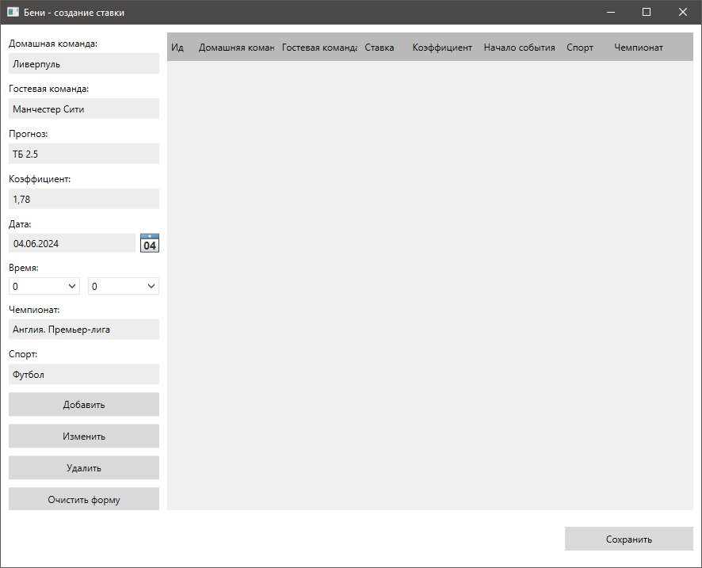

# Beny - трекер для ставок

## Описание

Программа для ведения учета ставок на спорт.

## Функционал
- CRUD всех моделей
- Автоподстановка в форме добавления/редактирования купона, что существенно упрощает работу с программой
- Фильтрация по году и месяцу на главной форме

## Главное окно 

## Окно для редактирования купона

## Стек

- SimpleInjector
- EntityFramework ( Sqlite )
- Mvvm-Dialogs
- Behaviors.WPF
